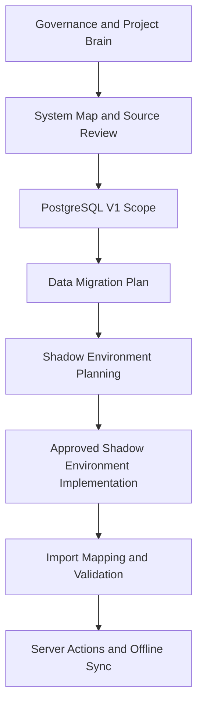

# PROJECT INDEX

## Repository

Name:
TalCompressors-ServiceReports-AI

Purpose:
Master source for ServiceApp_FIX project.

---

## Mandatory Startup Entry

Every Codex or ChatGPT project session must start with this file.

Official startup command:

- `hey codex`

Official shutdown command:

- `by codex`

Required `hey codex` startup order:

1. Locate the active Git repository root.
2. Run `git status --short --branch`.
3. If the working tree is clean, run `git fetch origin` and `git pull --ff-only origin main`.
4. If the working tree is not clean, STOP, report uncommitted changes, and do not pull until the user approves a stash, commit, or discard plan.
5. After a successful pull, run `git log -1 --oneline`.
6. Only then read `PROJECT_INDEX.md`.
7. Read `PROJECT_OPERATING_PROTOCOL.md`.
8. Read `project-brain/CURRENT_TASK.md`.
9. Read `project-brain/TASK_BOARD.md`.
10. Read relevant task-specific docs.

No implementation task may start until a short Project Reality Check is shown from the canonical files.

If the Project Reality Check cannot be produced, STOP and report the missing canonical source.

Project Reality Check must include:

- current phase
- Latest Git Commit live from `git log -1 --oneline`
- Git working state from `git status --short --branch`
- Last Implementation Commit recorded in `PROJECT_INDEX.md`
- Last Closeout Commit recorded in `PROJECT_INDEX.md`, if present
- Last Implementation Commit recorded in `project-brain/CURRENT_TASK.md`
- Last Closeout Commit recorded in `project-brain/CURRENT_TASK.md`, if present
- current task
- next approved task
- blocked or forbidden actions
- files relevant to the requested work

Project Reality Check must always run:

- `git status --short --branch`
- `git log -1 --oneline`

Then compare:

- latest Git commit
- Last Closeout Commit written in `PROJECT_INDEX.md`
- Last Implementation Commit written in `PROJECT_INDEX.md`
- Last Closeout Commit written in `project-brain/CURRENT_TASK.md`
- Last Implementation Commit written in `project-brain/CURRENT_TASK.md`

If live Git latest commit equals the recorded Last Closeout Commit, the repository and Project Brain are synchronized.

If live Git latest commit is newer than Last Closeout Commit but is only a closeout/state-sync metadata commit, do not block work and do not require another sync just to record that newest closeout hash.

Only block if live Git has unclassified implementation, product code, schema, or governance behavior changes not reflected in Project Brain:

- report the mismatch clearly
- recommend sync before implementation during `hey codex`
- update canonical state files during closeout / `by codex`
- do not continue implementation until the mismatch is acknowledged

If ChatGPT or Codex memory conflicts with Project Brain files, Project Brain wins.

## Autonomous Work Loop

Codex should work autonomously on safe tasks and stop only at meaningful approval gates.

Codex is the main Orchestrator. It must route work to existing agent owners by role, continue safe work automatically, validate, collect proof, update Project Brain, and stop only before critical approvals.

AUTO_ALLOWED:

- read files
- inspect repo
- run `git status` and `git log`
- run local tests/type checks
- run read-only DB queries
- run read-only UI validation
- create/update documentation
- fix UI/read-only mapping bugs
- create local validation reports
- update Project Brain after completed safe work
- commit/push safe documentation and read-only app changes after validation

APPROVAL_REQUIRED:

- `prisma/schema.prisma` changes
- Prisma `db push` or migration
- DB writes/imports
- Supabase project/settings changes
- Google Sheets/AppSheet/Maven/Apps Script changes
- production deployment
- email/Drive/customer-facing actions
- deleting data/files
- new agent/control architecture

Required loop:

1. `hey codex`
2. Reality Check
3. Load `PROJECT_INDEX.md` and `project-brain/TASK_BOARD.md`
4. Pick next approved task
5. Route work to the correct existing agent owner
6. Execute AUTO_ALLOWED work without stopping
7. Run validation
8. Check that no protected system was affected
9. Update Project Brain
10. Commit/push if safe and scoped
11. Stop only when APPROVAL_REQUIRED is reached
12. Present proof, risks, and exact approval request

When stopping at an approval gate, Codex must tell Liad what was done, what was checked, proof of success, risks, what approval is requested, what will happen after approval, and what systems were confirmed untouched.

When the user says `hey codex`:

1. Locate the active Git repository root.
2. Run `git status --short --branch`.
3. If the working tree is clean, run `git fetch origin` and `git pull --ff-only origin main`.
4. If the working tree is not clean, STOP, report uncommitted changes, and do not pull until the user approves a stash, commit, or discard plan.
5. After a successful pull, run `git log -1 --oneline`.
6. Only then read `PROJECT_INDEX.md`, `PROJECT_OPERATING_PROTOCOL.md`, `project-brain/CURRENT_TASK.md`, and `project-brain/TASK_BOARD.md`.
7. Produce Project Reality Check using the live Git commit as the source for latest commit.
8. Show live Git latest commit, Last Implementation Commit, and Last Closeout Commit.
9. Continue if live Git latest commit is recorded as Last Implementation Commit or Last Closeout Commit, or if live Git latest commit is only a closeout/state-sync metadata commit newer than Last Closeout Commit. If live Git contains unclassified implementation, code, schema, or governance behavior changes, report mismatch and recommend state sync before implementation.
10. Continue from next approved task only.
11. Do not invent new tasks.

When the user says `by codex`:

1. Run Project Reality Check.
2. Run `git status --short --branch`.
3. Run `git log -1 --oneline`.
4. Compare live Git latest commit against Last Implementation Commit and Last Closeout Commit.
5. Identify changed files.
6. Summarize completed work.
7. Summarize uncommitted changes.
8. Update canonical state files when needed and approved:
   - `PROJECT_INDEX.md`
   - `project-brain/CURRENT_TASK.md`
   - `project-brain/TASK_BOARD.md`
   - `project-brain/DECISION_LOG.md` if decisions changed
   - Last Closeout Commit only for meaningful closeout/state-sync milestones, not every closeout metadata commit
   - Last Implementation Commit only when actual implementation changed
9. Verify no forbidden systems were touched.
10. Verify next approved task is clear.
11. Commit only files approved by the user or allowed by the Autonomous Work Loop as safe, scoped, validated documentation/read-only app changes.
12. Push to `origin/main`.
13. Confirm clean `git status --short --branch`.
14. Confirm Git and Project Brain are synchronized.
15. Print next `hey codex` startup point.

Before creating any new planning file, map, dashboard, control center, protocol, agent, or roadmap, Codex must search existing files and prove no existing file already serves that purpose.

---

## Project Reality Check

This section is the living navigation screen. It summarizes current reality only by pointing to canonical owner files; do not duplicate full source content here.

| Field | Current Reality | Canonical Evidence |
|---|---|---|
| Current phase | Project Brain Consolidation Phase 1-3 completed; Supabase staging schema is applied, verified, Wave 1 staging import passed, and Wave 1 read/display mapping fixes are validated | `project-brain/CURRENT_TASK.md` |
| Current milestone | Wave 1 Next.js read/display validation PASS after PostgreSQL read switch | `project-brain/CURRENT_TASK.md`, `project-brain/TASK_BOARD.md` |
| Current task | Stop at next approval gate before Wave 2 or production-shadow work | `project-brain/CURRENT_TASK.md` |
| Next approved task | Approval gate only: decide whether to approve Wave 2 planning/discovery. No Wave 2 import, Maven work, production shadow, DB write, schema change, or source-system action is approved yet | `project-brain/CURRENT_TASK.md`, `project-brain/TASK_BOARD.md` |
| Last Implementation Commit | `fd76610 Fix Wave 1 service report display mapping` | Git history; `project-brain/CURRENT_TASK.md` |
| Last Closeout Commit | `8114210 Sync project brain commit model state` | Git history; `project-brain/CURRENT_TASK.md` |
| Completed phases | Governance foundation; Next.js shadow app; PostgreSQL V1 scope/schema; Prisma validation tooling; Project Brain Consolidation Phase 1-3; startup/shutdown workflow enforcement; Reality Check Git sync hardening; two-commit Reality Check model; autonomous agent orchestration governance | `project-brain/TASK_BOARD.md`, `project-brain/PROJECT_BRAIN_MASTER.md` |
| Blocked/forbidden actions | No production writes, Prisma migration, DB creation, Sheets/AppSheet/Maven actions, new planning/control files, new agents, or implementation before Reality Check | `PROJECT_OPERATING_PROTOCOL.md`, `project-brain/CURRENT_TASK.md` |
| Evidence links | Current task, task board, decisions, system map, migration scope, Prisma schema, protocol | Canonical file links below |

Canonical file links:

- Current state: `project-brain/CURRENT_TASK.md`
- Task board: `project-brain/TASK_BOARD.md`
- Decisions: `project-brain/DECISION_LOG.md`
- System map: `project-brain/maps/SYSTEM_MAP.md`
- Migration scope: `project-brain/migration/POSTGRESQL_V1_SCOPE.md`
- Prisma schema: `prisma/schema.prisma`
- Protocol: `PROJECT_OPERATING_PROTOCOL.md`

---

## Master Project Map

This map is a navigation summary only. The visual map is view-only and is not a source of truth. Source of truth remains `project-brain/CURRENT_TASK.md`, `project-brain/TASK_BOARD.md`, and `project-brain/roadmap/ROADMAP.md`.

| Area | Current Status | Canonical Owner |
|---|---|---|
| Current phase | Project Brain Consolidation Phase 1-3 completed; Supabase staging schema is applied, verified, Wave 1 staging import passed, and Wave 1 read/display mapping fixes are validated | `project-brain/CURRENT_TASK.md` |
| Completed phases | Governance foundation; Next.js shadow app; PostgreSQL V1 scope/schema; Prisma validation tooling; startup/shutdown workflow enforcement; Reality Check Git sync hardening; two-commit Reality Check model; autonomous agent orchestration governance | `project-brain/TASK_BOARD.md` |
| Current task | Stop at next approval gate before Wave 2 or production-shadow work | `project-brain/CURRENT_TASK.md`, `project-brain/TASK_BOARD.md` |
| Next approved task | Approval gate only: decide whether to approve Wave 2 planning/discovery. No Wave 2 import, Maven work, production shadow, DB write, schema change, or source-system action is approved yet | `project-brain/CURRENT_TASK.md`, `project-brain/TASK_BOARD.md` |
| Future phases | Supabase staging validation; Supabase production shadow setup; import mapping/validation; Server Actions architecture; offline queue/PWA sync; VPS/remote development planning | `project-brain/TASK_BOARD.md`, `project-brain/roadmap/ROADMAP.md` |
| Blocked phases | PostgreSQL environment implementation; database migration; import execution; production integration; Maven write flow | `project-brain/TASK_BOARD.md` |
| Dependency order | Governance and Project Brain state -> system map/source review -> PostgreSQL V1 scope -> data migration planning -> Supabase staging-first plan -> approved staging project/secrets -> Prisma reconciliation approval -> approved staging schema push -> read-only schema verification -> Wave 1 dry-run/import validation -> Waves 2-4 discovery/import approvals -> production shadow approval -> Server Actions/offline sync | `project-brain/TASK_BOARD.md`, `project-brain/migration/POSTGRESQL_V1_SCOPE.md`, `project-brain/migration/DATA_MIGRATION_PLAN.md` |
| Import waves | Structured `WAVE_ID` blocks define Wave 1 service-report core, Wave 2 service workflow, Wave 3 Maven data, and Wave 4 extended operations for agent-readable planning | `project-brain/migration/DATA_MIGRATION_PLAN.md`, `project-brain/migration/POSTGRESQL_V1_SCOPE.md` |
| System map | Current legacy and target system navigation | `project-brain/maps/SYSTEM_MAP.md` |

## Agent Task Routing

Route future tasks to existing agents before work starts. Do not create new agents unless no existing agent fits and approval is given.

Codex acts as the main Orchestrator and assigns work to the existing owner agent. Agent routing does not mean Codex must stop and ask Liad; Codex should continue AUTO_ALLOWED work through validation and Project Brain update.

| Task Type | Existing Owner Agent |
|---|---|
| Git work | `agents/GIT_AGENT.md` |
| Apps Script work | `agents/APPS_SCRIPT_AGENT.md` |
| Maven work | `agents/MAVEN_AGENT.md` |
| AI Draft work | `agents/AI_DRAFT_AGENT.md` |
| Architecture, schema, migration, governance | `agents/INFRASTRUCTURE_MANAGER_AGENT.md` |
| Project Brain updates | `agents/PROJECT_BRAIN_AGENT.md` |
| Parallel or multi-agent coordination | `agents/ORCHESTRATOR_AGENT.md` |
| Pre-mission risk review | `agents/PRE_MISSION_REVIEW_SYSTEM.md` |
| Audit or control review | `agents/FACTORY_CONTROL_CENTER_AGENT.md` |

---

## Supporting Read Order

After the mandatory startup files, read only the supporting files relevant to the task:

- START_CODEX.md, if using the Codex startup wrapper
- PROJECT_COMMANDS.md, if interpreting project commands
- agents/AGENT_REGISTRY.md, if routing agent work
- agents/INFRASTRUCTURE_MANAGER_AGENT.md, for architecture, schema, migration, source-of-truth, or future-platform work
- project-brain/PROJECT_BRAIN_MASTER.md, for durable memory
- project-brain/DECISION_LOG.md, for approved decisions
- project-brain/maps/SYSTEM_MAP.md, for the canonical system map
- project-brain/migration/POSTGRESQL_V1_SCOPE.md, for PostgreSQL migration scope
- prisma/schema.prisma, for the current Prisma schema
- data-sources/tools/SHEETS_REGISTRY.md, for sheet/schema evidence
- Latest relevant historical checkpoint under project-brain/checkpoints/, for historical context only

---

## Sources Of Truth

Priority Order:

1. PROJECT_OPERATING_PROTOCOL.md
2. PROJECT_INDEX.md
3. project-brain/CURRENT_TASK.md
4. project-brain/TASK_BOARD.md
5. project-brain/DECISION_LOG.md
6. project-brain/maps/SYSTEM_MAP.md
7. project-brain/migration/POSTGRESQL_V1_SCOPE.md
8. project-brain/PROJECT_BRAIN_MASTER.md
9. project-brain/roadmap/ROADMAP.md
10. project-brain/current/LIVE_OBJECTS.md
11. data-sources/tools/SHEETS_REGISTRY.md
12. Google Sheets live data
13. Apps Script
14. GitHub History

---

## Official Current State Sources

- Current task, current phase, and next task: project-brain/CURRENT_TASK.md
- Task board and progress map: project-brain/TASK_BOARD.md
- Official roadmap: project-brain/roadmap/ROADMAP.md
- Current live IDs: project-brain/current/LIVE_OBJECTS.md
- Checkpoints: historical context only unless explicitly marked as the latest relevant checkpoint

---

## Active Governance Agents

### Infrastructure Manager

Status:
Active

Files:
- agents/INFRASTRUCTURE_MANAGER_AGENT.md
- agents/INFRASTRUCTURE_REVIEW_TEMPLATE.md

Purpose:
Review architecture, schema, new table, new agent, registry, migration, source-of-truth, and future-platform requests before implementation.

---

## Main Systems

ServiceApp_FIX
AppSheet
Apps Script
Maven
Invoice4u

---

## Stable Systems

AutomationCommands Queue
BusinessDocuments Workflow
Maven Draft Creation

---

## Open Investigations

AppSheet Sync Performance
GitHub Connector Access
AI Draft Pilot

---

## Official Current Phase

Read from project-brain/CURRENT_TASK.md.

## Last Completed Phase

PHASE 0 - Governance Foundation COMPLETE

---

## Never Break

AutomationCommands Queue
BusinessDocuments Workflow
Report Counter Logic
Drive Folder Logic
