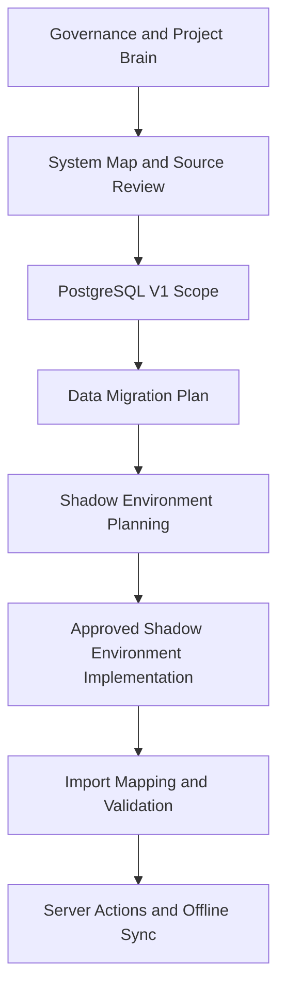

# PROJECT INDEX

## Repository

Name:
TalCompressors-ServiceReports-AI

Purpose:
Master source for ServiceApp_FIX project.

---

## Mandatory Startup Entry

Every Codex or ChatGPT project session must start with this file.

Official startup command:

- `hey codex`

Official shutdown command:

- `by codex`

Required `hey codex` startup order:

1. Locate the active Git repository root.
2. Run `git status --short --branch`.
3. If the working tree is clean, run `git fetch origin` and `git pull --ff-only origin main`.
4. If the working tree is not clean, STOP, report uncommitted changes, and do not pull until the user approves a stash, commit, or discard plan.
5. After a successful pull, run `git log -1 --oneline`.
6. Only then read `START_CODEX.md`.
7. Read `PROJECT_INDEX.md`.
8. Read `PROJECT_OPERATING_PROTOCOL.md`.
9. Read `project-brain/CURRENT_TASK.md`.
10. Read `project-brain/TASK_BOARD.md`.
11. Read `project-brain/DECISION_LOG.md`.
12. Read `project-brain/current/LIVE_OBJECTS.md` for active IDs when present.
13. Read relevant task-specific docs.

No implementation task may start until a short Project Reality Check is shown from the canonical files.

If the Project Reality Check cannot be produced, STOP and report the missing canonical source.

Project Reality Check must include:

- PROJECT MODE
- Current Mode: `CAPABILITY_BUILDING`
- Governance Status: `FROZEN`
- TDOS Status: `FROZEN / Maintenance Mode`
- Current Priority: working runtime capabilities instead of documentation expansion
- current phase
- Latest Git Commit live from `git log -1 --oneline`
- Git working state from `git status --short --branch`
- Last Implementation Commit recorded in `PROJECT_INDEX.md`
- Last Closeout Commit recorded in `PROJECT_INDEX.md`, if present
- Last Implementation Commit recorded in `project-brain/CURRENT_TASK.md`
- Last Closeout Commit recorded in `project-brain/CURRENT_TASK.md`, if present
- current task
- next approved task
- known active IDs with source files, or active ID conflicts with source files
- blocked or forbidden actions
- files relevant to the requested work
- duplicate work prevented
- reuse percentage
- capabilities added
- capabilities waiting
- capabilities blocked
- documentation created
- capability/documentation ratio
- project acceleration score
- outstanding executive decisions
- highest-value capability
- highest-value runtime task
- TDOS risk class for the requested work, using `PROJECT_OPERATING_PROTOCOL.md` section `18B. TDOS Risk-Based Operating Model`

Project Reality Check must always run:

- `git status --short --branch`
- `git log -1 --oneline`

Then compare:

- latest Git commit
- Last Closeout Commit written in `PROJECT_INDEX.md`
- Last Implementation Commit written in `PROJECT_INDEX.md`
- Last Closeout Commit written in `project-brain/CURRENT_TASK.md`
- Last Implementation Commit written in `project-brain/CURRENT_TASK.md`

If live Git latest commit equals the recorded Last Closeout Commit, the repository and Project Brain are synchronized.

If live Git latest commit is newer than Last Closeout Commit but is only a closeout/state-sync metadata commit, do not block work and do not require another sync just to record that newest closeout hash.

Only block if live Git has unclassified implementation, product code, schema, or governance behavior changes not reflected in Project Brain:

- report the mismatch clearly
- recommend sync before implementation during `hey codex`
- update canonical state files during closeout / `by codex`
- do not continue implementation until the mismatch is acknowledged

If ChatGPT or Codex memory conflicts with Project Brain files, Project Brain wins.

Active ID rule:

- Known active IDs must be loaded from canonical Project Brain state before startup and closeout reports.
- Canonical lookup order is `project-brain/CURRENT_TASK.md`, then task-specific evidence docs referenced by the current task, then `project-brain/current/LIVE_OBJECTS.md`.
- Report the source file for each known active ID.
- If no new work occurred, closeout must preserve the last known active IDs.
- Use `UNKNOWN` only when canonical files truly do not contain the active ID.
- If active IDs conflict across canonical files, report the conflict and source files instead of overwriting or silently downgrading to `UNKNOWN`.

## Autonomous Work Loop

Codex should work autonomously on safe tasks and stop only at meaningful approval gates.

Current Project Mode:
`CAPABILITY_BUILDING`

Governance Status:
`FROZEN`

TDOS Status:
`FROZEN / Maintenance Mode`

Current Priority:
ERP capability implementation. TDOS should evolve only when ERP work is blocked by a missing TDOS capability, real Project Brain/runtime drift is detected, or Knowledge Release becomes required for an active ChatGPT Project Sources workflow.

TDOS risk-based operating model:
`PROJECT_OPERATING_PROTOCOL.md` section `18B. TDOS Risk-Based Operating Model` defines the task risk classes and required controls. No required control for the task's risk class may be skipped.

Codex is the main Orchestrator and Project Executive. Every new task, idea, bug, feature, investigation, proposal, or request must pass through the Orchestrator Decision Engine in `agents/ORCHESTRATOR_AGENT.md` before work begins. It must understand, discover, consult, score, decide, execute, validate, learn, and improve. It must route work to existing agent owners by role, continue safe work automatically, validate, collect proof, update Project Brain, and stop only before critical approvals.

The Orchestrator must optimize for least duplication, maximum reuse, shortest safe path, highest business value, highest project acceleration, evidence-based decisions, minimal token usage, minimal user interruptions, minimal unnecessary documentation, minimal unnecessary agents, and minimal unnecessary complexity.

Before selecting a solution, the Orchestrator must consult all relevant existing specialist agents, governance systems, and Project Brain workflow roles from `agents/AGENT_REGISTRY.md`. Each consultation must contribute or be summarized with recommendation, risks, evidence, confidence, and better alternatives. The Orchestrator summarizes the opinions before deciding.

Every candidate task or solution path must be scored for Business Value, Technical Value, Project Acceleration, Reuse Score, Duplicate Risk, Runtime Impact, Long-term Value, Complexity, and Estimated Time. The highest-value safe task should normally be selected.

Authority levels:

- `AUTO_EXECUTE`: safe scoped work under current approval and AUTO_ALLOWED rules.
- `REPORT_ONLY`: read-only discovery, analysis, evidence packet, or recommendation.
- `APPROVAL_REQUIRED`: Liad must decide before protected, production, schema, DB, source-system, financial, customer-facing, env/dependency, or external-write work.
- `FORBIDDEN`: do not proceed because the task conflicts with current state, approval gates, source-of-truth rules, or reuse-before-create rules.

Success metric:
The project is measured by capabilities added, not by the number of documents added. The project no longer exists to document ideas; it exists to deliver working capabilities. If a proposed task only creates a document, the Orchestrator must stop and recommend merge, reuse, extend, or reject unless Liad explicitly approves the governance work or the documentation is required to build a capability safely.

Capability-first rule:
Every proposed task must answer what new capability will exist after the task finishes. If the answer is `No new capability`, the Orchestrator must stop and recommend merge, reuse, extend, or reject.

Governance freeze:
Governance is mature. Creating new specs, registries, knowledge bases, governance documents, roadmap items, or decision systems is `FORBIDDEN` unless a governance bug is discovered, a safety issue exists, Liad explicitly approves, or a capability cannot be built safely without it. Otherwise, reuse, merge, or extend existing assets.

Duplicate prevention:
Before creating any Agent, Registry, Spec, Rule, Knowledge Base, or Roadmap Item, the Orchestrator must prove existing assets were already searched, already verified, and already rejected as insufficient. If that proof is missing, creation is `FORBIDDEN`; extend, merge, or reuse existing assets instead.

Executive self-improvement:
After every completed task, the Orchestrator must ask whether it could have been completed faster, with fewer files, fewer agents, fewer tokens, less duplication, or less user involvement. If yes, generate an Improvement Evidence Packet for Liad; after approval, update Project Brain and teach future agents by extending existing files.

After every completed task, Codex must update Project Brain before the final report. The update must record what was completed, commit hash, validation results, current blocker or `none`, exact next task, approval gates, and project completion percentage.

Required update targets:

- `project-brain/CURRENT_TASK.md`
- `project-brain/TASK_BOARD.md`
- `project-brain/DECISION_LOG.md` when decisions changed
- `PROJECT_INDEX.md` when structure, status, navigation, current task, next task, or completion state changed

If validation proves a blocker was resolved, remove it from current blocker state. Final responses must not describe resolved blockers as still blocked.

After a successful feature commit, Codex may automatically edit Project Brain docs and run `git add`, `git commit`, and `git push` for the Project Brain sync.

AUTO_ALLOWED:

- read files
- inspect repo
- run `git status` and `git log`
- run local tests/type checks
- run read-only DB queries
- run read-only UI validation
- create/update documentation
- fix UI/read-only mapping bugs
- create local validation reports
- update Project Brain after completed safe work
- update Project Brain before every final report after a completed task
- commit/push safe documentation and read-only app changes after validation

AUTO_APPROVED:

Git:

- `git fetch`
- `git pull --ff-only`
- `git status`
- `git log`
- `git branch -vv`

Read-only validation:

- read-only validation
- read-only database queries
- read-only DB query
- Prisma read-only queries
- staging read-only verification
- count validation
- relationship validation

Local development:

- local tests
- TypeScript compile checks
- Next.js build checks
- Next.js local dev startup
- local HTTP validation
- Playwright read-only validation
- screenshot generation for proof
- HTML render validation
- route validation

Project Brain:

- update Project Brain after completed safe work
- update `project-brain/CURRENT_TASK.md`
- update `project-brain/TASK_BOARD.md`
- update `project-brain/DECISION_LOG.md`
- update `PROJECT_INDEX.md` references
- update migration plans
- update wave progress
- commit and push Project Brain closeout sync after a successful feature commit

Safe commits:

- documentation-only commits
- Project Brain commits
- governance commits
- read-only validation report commits
- safe implementation commits after validation
- `git push` of approved safe-scope work

Do not ask Liad for approval when executing AUTO_APPROVED actions. Only stop for APPROVAL_REQUIRED gates.

APPROVAL_REQUIRED:

- env changes
- installing any new npm package; approval must name each package explicitly
- `prisma/schema.prisma` changes
- Prisma `db push`
- Prisma `migrate`
- DB writes
- imports
- seeds
- Supabase project/settings changes
- Google Sheets changes
- AppSheet changes
- Maven changes
- Apps Script changes
- Drive writes
- email/customer-facing actions
- production deployment
- production cutover
- git remote changes
- deletes/moves
- deleting business data
- deleting source files
- new agent architecture
- new governance architecture

Before stopping for approval, Codex must first verify whether the action is AUTO_APPROVED.

If AUTO_APPROVED, continue working.

If APPROVAL_REQUIRED, stop and present:

Executive Approval Report:

```
━━━━━━━━━━━━━━━━━━━━━━━━━━━━━━
EXECUTIVE APPROVAL REQUEST
━━━━━━━━━━━━━━━━━━━━━━━━━━━━━━

PROJECT POSITION

* Current Wave
* Current Task
* Project Completion %
* Next Wave

REQUEST

* What Codex wants to do

WHY

* Why this action is needed

EVIDENCE

* What was checked
* What proof exists
* Validation results
* Before/After summary

FILES TO CHANGE

* Exact files

SYSTEMS TOUCHED

* Exact systems affected

SYSTEMS CONFIRMED UNTOUCHED

* Google Sheets
* AppSheet
* Maven
* Apps Script
* Production

IMPACT ANALYSIS

Systems affected:

* exact files
* exact modules
* exact routes
* exact tables
* exact agents

Systems verified unaffected:

* Project Brain
* Governance
* Wave 1
* Existing imports
* Existing Prisma schema
* Existing Supabase data
* Existing AppSheet logic
* Existing Maven integrations
* Existing automation flows
* Existing inventory logic

Regression Review:

* What was checked
* How it was checked
* Evidence

Dependency Review:

* Which future waves depend on this area
* Whether the change can block future work
* Whether approved architecture changes

Approval Confidence:

* LOW
* MEDIUM
* HIGH

Mandatory statement:

* "I checked for impact on existing project logic and future approved project roadmap."

RISK

* Low / Medium / High
* Explanation

ROLLBACK

* How to undo the change

AFTER APPROVAL

* Exact next action
* Expected outcome

DECISION REQUIRED

* Approve
* Reject
* Modify

━━━━━━━━━━━━━━━━━━━━━━━━━━━━━━
```

Executive Approval Report rules:

- The executive summary must fit within about 15 lines before detailed evidence.
- Do not present raw logs first.
- Detailed evidence may appear below the summary.
- Include Project Tree Position and PROJECT COMPLETION MODEL.
- Include Risk, Rollback, and Systems Confirmed Untouched.
- Include IMPACT ANALYSIS. No approval request is valid without Impact Analysis.
- Stop and wait for Liad's decision.

Required loop:

1. `hey codex`
2. Reality Check
3. Load `PROJECT_INDEX.md` and `project-brain/TASK_BOARD.md`
4. Pick next approved task
5. Route work to the correct existing agent owner
6. Execute AUTO_ALLOWED work without stopping
7. Run validation
8. Check that no protected system was affected
9. Update Project Brain
10. Commit/push if safe and scoped
11. Stop only when APPROVAL_REQUIRED is reached
12. Present proof, risks, and exact approval request

When stopping at an approval gate, Codex must use the Executive Approval Report format and tell Liad what was done, what was checked, proof of success, risks, what approval is requested, what will happen after approval, and what systems were confirmed untouched.

Proof Requirement:

Before closing any completed task, Codex must provide:

1. What was wrong before
2. What changed
3. Evidence
4. Validation result
5. User-visible impact

Preferred evidence includes screenshots, Playwright screenshots, HTML render samples, before/after comparisons, and counts.

A task is not considered complete with only HTTP 200, PASS, or compile success. Codex must demonstrate the visible outcome whenever possible.

When the user says `hey codex`:

1. Locate the active Git repository root.
2. Run `git status --short --branch`.
3. If the working tree is clean, run `git fetch origin` and `git pull --ff-only origin main`.
4. If the working tree is not clean, STOP, report uncommitted changes, and do not pull until the user approves a stash, commit, or discard plan.
5. After a successful pull, run `git log -1 --oneline`.
6. Only then read `START_CODEX.md`, `PROJECT_INDEX.md`, `PROJECT_OPERATING_PROTOCOL.md`, `project-brain/CURRENT_TASK.md`, `project-brain/TASK_BOARD.md`, and `project-brain/DECISION_LOG.md`.
7. Produce Project Reality Check using the live Git commit as the source for latest commit.
8. Show live Git latest commit, Last Implementation Commit, and Last Closeout Commit.
9. Continue if live Git latest commit is recorded as Last Implementation Commit or Last Closeout Commit, or if live Git latest commit is only a closeout/state-sync metadata commit newer than Last Closeout Commit. If live Git contains unclassified implementation, code, schema, or governance behavior changes, report mismatch and recommend state sync before implementation.
10. Continue from next approved task only.
11. Do not invent new tasks.

When the user says `by codex`:

1. Run Project Reality Check.
2. Run `git status --short --branch`.
3. Run `git log -1 --oneline`.
4. Compare live Git latest commit against Last Implementation Commit and Last Closeout Commit.
5. Identify changed files.
6. Summarize completed work.
7. Summarize uncommitted changes.
8. Update canonical state files when needed and either approved or allowed by the Autonomous Work Loop:
   - `PROJECT_INDEX.md`
   - `project-brain/CURRENT_TASK.md`
   - `project-brain/TASK_BOARD.md`
   - `project-brain/DECISION_LOG.md` if decisions changed
   - Last Closeout Commit only for meaningful closeout/state-sync milestones, not every closeout metadata commit
   - Last Implementation Commit only when actual implementation changed
9. Verify no forbidden systems were touched.
10. Verify next approved task is clear.
11. Commit only files approved by the user or allowed by the Autonomous Work Loop as safe, scoped, validated documentation/read-only app changes.
12. Push to `origin/main`.
13. Confirm clean `git status --short --branch`.
14. Confirm Git and Project Brain are synchronized.
15. Print next `hey codex` startup point.

Before creating any new planning file, map, dashboard, control center, protocol, agent, or roadmap, Codex must search existing files and prove no existing file already serves that purpose.

---

## Project Reality Check

This section is the living navigation screen. It summarizes current reality only by pointing to canonical owner files; do not duplicate full source content here.

| Field | Current Reality | Canonical Evidence |
|---|---|---|
| Current phase | Project Brain Consolidation Phase 1-3 completed; Supabase staging schema is applied, verified, Wave 1 staging import passed, and Wave 1 read/display mapping fixes are validated | `project-brain/CURRENT_TASK.md` |
| Current milestone | TDOS is frozen in Maintenance Mode and project focus has returned to ERP capability implementation. BusinessCase Runtime Sprint 1, Commercial Lifecycle Hardening Sprint 2, Financial Capability Sprint 3, Operations Center Sprint 4, Operations Command Center Sprint 5, Customer 360 Workspace Sprint 6, End-to-End Service Flow MVP Sprint 7, Generalized BusinessDocument Draft Gateway Sprint 8, Business Intent Policy Layer Sprint 9, Production Draft Generation Sprint 10, and Production Draft Review and Learning Loop Sprint 11 are implemented. Domain-driven Commercial, Financial, customer, operational workspace, service-flow integration, draft-gateway, intent-policy, production draft generation, and approved-correction learning runtime work is started. Universal Business Document Engine foundation, Domain Boundary Refactoring, Financial Intake Engine design, internal BusinessDocument/payment review, Hebrew customer-facing BusinessDocument preview/PDF, manufacturer SKU Excel source planning, ServiceReport 5806 SKU matching runtime MVP, Manufacturer Parts Registry Import + Service Kit Intelligence MVP, Manufacturer Registry Alias and Conflict Validation, Legacy Excel Parser Strategy, Maven sample reference asset, internal PDF export planning, MVP, smoke test, governance lock, and visual polish fixes, Maven payload builder extraction, Maven terminology correction, Maven source inventory, and Maven API placeholders are complete. Maven is classified as an External Adapter under Automation and Integration, not as the architectural center. Wave 2 Service Workflow Layer is complete, frozen except bug fixes, and architecture-audited | `project-brain/CURRENT_TASK.md`, `project-brain/TASK_BOARD.md` |
| Current task | Production Draft Review and Learning Loop Sprint 11 completed as `SAFE_LOCAL_IMPLEMENTATION`. `/business-documents/[id]` now exposes generated draft title quality, line quality, price confidence, missing evidence, recommended corrections, correction workflow readiness, and learning eligibility. The existing BusinessDocument approval action records structured approved learning evidence only for production-generated drafts. Validation used Sprint 10 drafts `NEXT-BD-DRAFT-acd1133d-QUOTE`, `NEXT-BD-DRAFT-891a1dd7-QUOTE`, and `NEXT-BD-DRAFT-e645e483-QUOTE`; the corrected `e645e483` draft was reviewed, line-corrected through the existing forms, approved internally, and became reusable approved BusinessDocumentItem evidence for future draft generation. Maven/Invoice4U, email, inventory, OCR, bank API, receipt issuing, schema changes, packages, and external actions remain untouched | `project-brain/CURRENT_TASK.md`, `project-brain/TASK_BOARD.md`, `project-brain/DECISION_LOG.md`, `APPLICATION_ROUTE_MAP.md` |
| Next approved task | ERP capability implementation remains active. Recommended next safe/context capability is Asset Workspace / Asset Timeline so TAL can review compressor-level service, commercial, financial, recommendation, blocker, and customer history from existing runtime. If Liad wants deeper write-side draft learning first, the next task should be correction persistence type expansion for non-price/title/line decisions and would require a separate approval gate if schema or new DB writes are needed. Real Maven execution for `NEXT-MAVEN-CMD-NEXT-AI-DRAFT-5806` requires separate explicit Liad approval and the readiness checklist in `project-brain/CURRENT_TASK.md`. DB writes outside approved protected Server Actions remain gated and require explicit human approval | `project-brain/CURRENT_TASK.md`, `project-brain/TASK_BOARD.md`, `DATA_COVERAGE_AUDIT.md` |
| TDOS operating model | Integrated into `PROJECT_OPERATING_PROTOCOL.md` as section `18B`; tasks now use risk classes instead of one universal ceremony | `PROJECT_OPERATING_PROTOCOL.md`, `project-brain/DECISION_LOG.md` |
| Last Implementation Commit | `782d44d Add production draft learning loop` | Git history; `project-brain/CURRENT_TASK.md` |
| Last Closeout Commit | `b5c5418 Sync project brain after operations command center` | Git history; `project-brain/CURRENT_TASK.md` |
| Completed phases | Governance foundation; Next.js shadow app; PostgreSQL V1 scope/schema; Prisma validation tooling; Project Brain Consolidation Phase 1-3; startup/shutdown workflow enforcement; Reality Check Git sync hardening; two-commit Reality Check model; autonomous agent orchestration governance | `project-brain/TASK_BOARD.md`, `project-brain/PROJECT_BRAIN_MASTER.md` |
| Blocked/forbidden actions | No production writes, Prisma migration, DB creation, Sheets/AppSheet/Maven actions, new planning/control files, new agents, or implementation before Reality Check | `PROJECT_OPERATING_PROTOCOL.md`, `project-brain/CURRENT_TASK.md` |
| Evidence links | Current task, task board, decisions, system map, migration scope, Prisma schema, protocol | Canonical file links below |

Canonical file links:

- Current state: `project-brain/CURRENT_TASK.md`
- Task board: `project-brain/TASK_BOARD.md`
- Decisions: `project-brain/DECISION_LOG.md`
- Application route map: `APPLICATION_ROUTE_MAP.md`
- Data coverage audit: `DATA_COVERAGE_AUDIT.md`
- System map: `project-brain/maps/SYSTEM_MAP.md`
- Maven source inventory: `project-brain/migration/MAVEN_SOURCE_INVENTORY.md`
- Knowledge Base consolidation report: `project-brain/KNOWLEDGE_BASE_CONSOLIDATION_REPORT.md`
- Manufacturer parts registry KB: `project-brain/MANUFACTURER_PARTS_REGISTRY.md`
- Manufacturer service kits KB: `project-brain/MANUFACTURER_SERVICE_KITS.md`
- Service commercial rules KB: `project-brain/SERVICE_COMMERCIAL_RULES.md`
- Service Maven mapping KB: `project-brain/SERVICE_MAVEN_MAPPING.md`
- Document engine KB: `project-brain/DOCUMENT_ENGINE.md`
- SKU matching rules KB: `project-brain/SKU_MATCHING_RULES.md`
- Migration scope: `project-brain/migration/POSTGRESQL_V1_SCOPE.md`
- Prisma schema: `prisma/schema.prisma`
- Protocol: `PROJECT_OPERATING_PROTOCOL.md`

---

## Master Project Map

This map is a navigation summary only. The visual map is view-only and is not a source of truth. Source of truth remains `project-brain/CURRENT_TASK.md`, `project-brain/TASK_BOARD.md`, and `project-brain/roadmap/ROADMAP.md`.

## Canonical Project Tree

Every Reality Check, Approval Gate, Autonomous Completion Report, and `by codex` closeout must include Project Tree Position using this canonical tree and these exact headings:

PROJECT TREE
PROJECT
├─ Wave 1 Party, Asset, and Service Operations Core
│  STATUS: COMPLETE ✓
├─ Wave 2 BusinessCase and Service Workflow Layer
│  STATUS: COMPLETE
├─ Wave 3 Commercial Runtime and Document Engine
│  STATUS: STARTED INTERNAL
├─ Wave 4 Financial Runtime and Settlement
│  STATUS: PENDING
├─ Wave 5 Inventory and Procurement
│  STATUS: PENDING
├─ Wave 6 Automation and Integration Adapters
│  STATUS: PENDING
├─ Wave 7 Offline Field Runtime
│  STATUS: PENDING
├─ Wave 8 Production Shadow
│  STATUS: PENDING
└─ Wave 9 Production Cutover and AppSheet Retirement
   STATUS: PENDING

CURRENT POSITION

- Current Wave
- Current Task
- Last Completed Task
- Next Task

PROJECT COMPLETION MODEL

- Capability
- Weight
- Status
- Progress contribution

CRITICAL PATH

- Remaining domain capabilities required for project completion

NEXT APPROVAL GATE

- Exact gate
- Why approval is required
- What happens after approval

Current Project Tree Position:

- Current Wave: Wave 3 Commercial Runtime and Document Engine; external adapter readiness remains gated separately
- Project Mode: `CAPABILITY_BUILDING`
- Governance Status: `FROZEN`
- TDOS Status: `FROZEN / Maintenance Mode`
- Current Priority: ERP capability implementation; no more TDOS architecture unless ERP work proves a missing TDOS capability, real Project Brain/runtime drift appears, or Knowledge Release becomes required for active ChatGPT Project Sources use
- Current Task: Production Draft Review and Learning Loop Sprint 11 complete; generated drafts can be reviewed for title quality, line quality, price confidence, missing evidence, recommended corrections, approved-correction evidence, and future reuse readiness.
- Last Completed Task: Production Draft Generation Sprint 10
- Next Task: Recommended next safe/context capability is Asset Workspace / Asset Timeline. If Liad wants deeper draft learning first, run correction persistence type expansion and stop for schema/DB approval if required.
- Estimated completion %: 80%
- Completion basis: capability-weighted evidence, not completed-waves / total-waves.
- Governance / Project Brain / Git workflow: 15% / 15% COMPLETE
- Supabase + Prisma Data Layer: 15% / 15% COMPLETE
- Import Framework + Wave 1 Import: 10% / 10% COMPLETE
- Wave 1 Party, Asset, and Service Operations Core: 10% / 10% COMPLETE
- Wave 2 BusinessCase and Service Workflow Layer: 15% / 15% COMPLETE
- Wave 3 Commercial Runtime and Document Engine: 14% / 15% STARTED INTERNAL
- Wave 4 Financial Runtime and Settlement: 1% / 10% STARTED INTERNAL
- Wave 5 Inventory and Procurement: 0% / 5% PENDING
- Wave 6 Automation and Integration Adapters: 0% / 3% PENDING
- Wave 7-9 Offline Field Runtime / Production Shadow / Cutover / AppSheet Retirement: 0% / 2% PENDING
- Completion formula: 15 + 15 + 10 + 10 + 15 + 14 + 1 + 0 + 0 + 0 = 80.
- Critical Path: Asset Workspace / Asset Timeline if read-only context remains the priority -> correction persistence/type expansion if deeper draft learning requires it -> BusinessDocument type expansion design if unsupported future document types are selected -> Inventory and Procurement boundaries -> FinancialEvidence persistence/attachments when explicitly approved -> Operations Command Center / Customer 360 follow-up persistence if explicitly approved -> Automation and Integration adapter readiness -> External Adapter evidence packets, including Maven/Invoice4U when selected -> Offline Field Runtime -> Production Shadow -> Production Cutover and AppSheet Retirement
- Next Approval Gate: Liad must explicitly approve any real Maven/Invoice4U execution, schema change, DB write/import, package install, customer-facing email/send, inventory action, source-system/cloud action, or production action. Real Maven execution approval must cover `NEXT-MAVEN-CMD-NEXT-AI-DRAFT-5806`, primary Maven document-generation API contract evidence, executor ownership, target Maven environment, final dry-run payload, idempotency check, allowed post-execution writes, failure handling, and rollback/containment plan.

Rule: a task is not considered complete unless Project Tree Position is reported.

Rule: Proof Requirement and Project Tree Position are both mandatory.

## Completion Model

Progress percentage is evidence-based and capability-weighted. Do not calculate project progress as completed waves divided by total waves.

Capability weights:

- Governance / Project Brain / Git workflow: 15%
- Supabase + Prisma Data Layer: 15%
- Import Framework + Wave 1 Import: 10%
- Wave 1 Party, Asset, and Service Operations Core: 10%
- Wave 2 BusinessCase and Service Workflow Layer: 15%
- Wave 3 Commercial Runtime and Document Engine: 15%
- Wave 4 Financial Runtime and Settlement: 10%
- Wave 5 Inventory and Procurement: 5%
- Wave 6 Automation and Integration Adapters: 3%
- Wave 7-9 Offline Field Runtime / Production Shadow / Cutover / AppSheet Retirement: 2%

Every Reality Check, completion report, and approval gate must show:

PROJECT COMPLETION MODEL

- Capability
- Weight
- Status
- Progress contribution

Current evidence-based estimate:

- Governance / Project Brain / Git workflow: 15% / 15% COMPLETE
- Supabase + Prisma Data Layer: 15% / 15% COMPLETE
- Import Framework + Wave 1 Import: 10% / 10% COMPLETE
- Wave 1 Party, Asset, and Service Operations Core: 10% / 10% COMPLETE
- Wave 2 BusinessCase and Service Workflow Layer: 15% / 15% COMPLETE
- Wave 3 Commercial Runtime and Document Engine: 14% / 15% STARTED INTERNAL
- Wave 4 Financial Runtime and Settlement: 1% / 10% STARTED INTERNAL
- Wave 5 Inventory and Procurement: 0% / 5% PENDING
- Wave 6 Automation and Integration Adapters: 0% / 3% PENDING
- Wave 7-9 Offline Field Runtime / Production Shadow / Cutover / AppSheet Retirement: 0% / 2% PENDING

Current estimated completion: 80%.

This estimate is valid as a transitional capability-weighted score because the first four capabilities are complete by Project Brain evidence and Wave 2 has 15% documented contribution from the read-only Equipment, PartsUsed, Service Report central work-screen, bidirectional navigation, Service Reports list context, AI Draft Suggestions shell, BusinessDocuments shell, AutomationCommands shell, SCR matching preview panel enhancements, the AI Draft Recommendation Preview runtime for Service Report `5806`, the pricing-evidence preview layer, the protected AI Draft Approval to BusinessDocument Draft runtime, the BusinessDocument Review and Approval Page, the BusinessDocument Approval Workflow, the protected Maven document-generation AutomationCommand gate, AutomationCommand Detail and Queue Review, Maven Execution Adapter Dry Run, and BusinessDocument Line Resolution Layer. Wave 3 is now interpreted as Commercial Runtime and Document Engine work plus operational workspace surfaces: it has started with read-only discovery/planning artifacts, an extracted internal Maven payload builder/validator as adapter-readiness support, Maven API placeholders, the internal BusinessDocument/payment review engine, the internal BusinessDocument HTML preview, the temporary internal PDF download route, ServiceReport `5806` runtime manufacturer SKU matching from trusted PM Series evidence, generated Manufacturer Parts Registry fixtures, service-kit intelligence, alias conflict validation, Legacy Excel Parser Strategy, Universal BusinessDocument ViewModel foundation, domain-boundary helpers, BusinessCase Runtime Sprint 1, Commercial Lifecycle Hardening Sprint 2, Operations Center Sprint 4, Operations Command Center Sprint 5, Customer 360 Workspace Sprint 6, End-to-End Service Flow MVP Sprint 7, Generalized BusinessDocument Draft Gateway Sprint 8, Business Intent Policy Layer Sprint 9, Production Draft Generation Sprint 10, and Production Draft Review and Learning Loop Sprint 11, adding 14% of the Wave 3 capability weight. Wave 4 Financial Runtime and Settlement has started with Financial Capability Sprint 3: internal FinancialEvidence draft intake, matching, approval review, receipt draft, tax invoice / receipt draft, and BusinessCase financial status, adding 1% of the Wave 4 capability weight. If any of those capabilities are later found partial, estimate lower and explain why. A future approved scoring pass should replace the transitional wave labels with a domain capability scorecard rather than changing percentages ad hoc.

Readiness split:

- Infrastructure readiness: high for staging, Prisma, Wave 1 import, and read-only Supabase validation evidence.
- Workflow UI coverage: Wave 2 workflow coverage is complete and frozen except bug fixes. Wave 3 Commercial Runtime and Document Engine has BusinessCase Runtime Sprint 1, Commercial Lifecycle Hardening Sprint 2, Operations Center Sprint 4, Operations Command Center Sprint 5, Customer 360 Workspace Sprint 6, End-to-End Service Flow MVP Sprint 7, Generalized BusinessDocument Draft Gateway Sprint 8, Business Intent Policy Layer Sprint 9, internal BusinessDocument/payment review, internal HTML preview, internal temporary PDF download, ServiceReport `5806` runtime manufacturer SKU matching, and read-only discovery/planning artifacts. Wave 4 Financial Runtime and Settlement has started with internal Financial Intake, matching, approval review, receipt draft, tax invoice / receipt draft, and BusinessCase financial status. Maven remains an External Adapter readiness concern under Automation and Integration.
- Production automation readiness: gated; protected internal command creation exists, but Maven/Invoice4U execution, email/customer-facing actions, inventory actions, DB imports, production integrations, schema changes, and migrations require separate explicit human approval.

| Area | Current Status | Canonical Owner |
|---|---|---|
| Current phase | Project Brain Consolidation Phase 1-3 completed; Supabase staging schema is applied, verified, Wave 1 staging import passed, and Wave 1 read/display mapping fixes are validated | `project-brain/CURRENT_TASK.md` |
| Completed phases | Governance foundation; Next.js shadow app; PostgreSQL V1 scope/schema; Prisma validation tooling; startup/shutdown workflow enforcement; Reality Check Git sync hardening; two-commit Reality Check model; autonomous agent orchestration governance | `project-brain/TASK_BOARD.md` |
| Current task | Production Draft Review and Learning Loop Sprint 11 is complete; generated drafts can be reviewed, corrected through existing line-resolution forms, approved through the existing BusinessDocument approval workflow, and exposed as approved future learning evidence only after approval. Real Maven execution, receipt issuing, OCR, bank API, saved PDF persistence, customer delivery/export, inventory action, schema changes, DB imports, parser implementation, parser package installs, LibreOffice install/conversion, and new npm package installs without package-specific approval are not approved | `project-brain/CURRENT_TASK.md`, `project-brain/TASK_BOARD.md`, `project-brain/DECISION_LOG.md`, `APPLICATION_ROUTE_MAP.md` |
| Next approved task | Domain-driven next task selection is active. Recommended next safe/context capability is Asset Workspace / Asset Timeline. Other valid candidates are correction persistence type expansion if Liad wants deeper write-side learning, BusinessDocument type expansion design if unsupported future document types are selected, Inventory and Procurement boundary/readiness, FinancialEvidence persistence/attachment storage if explicitly selected, Automation and Integration adapter readiness, or BusinessCase runtime generalization if a future capability proves it necessary. Maven customer/document/item matching, real Maven document-generation API contract evidence, Maven API secret placement, and read-only Maven source validation remain valid only as explicitly selected External Adapter readiness tasks. Real Maven execution for `NEXT-MAVEN-CMD-NEXT-AI-DRAFT-5806` requires separate explicit Liad approval and the readiness checklist in `project-brain/CURRENT_TASK.md`. DB writes outside approved protected Server Actions remain gated and require explicit human approval | `project-brain/CURRENT_TASK.md`, `project-brain/TASK_BOARD.md`, `DATA_COVERAGE_AUDIT.md` |
| Future phases | Supabase staging validation; Supabase production shadow setup; import mapping/validation; AI Draft Recommendation Readiness; Action Server Knowledge Layer; Email Document Intake evidence planning; Server Actions architecture; offline queue/PWA sync; VPS/remote development planning | `project-brain/TASK_BOARD.md`, `project-brain/roadmap/ROADMAP.md` |
| Blocked phases | PostgreSQL environment implementation; database migration; import execution; production integration; real Maven execution gate | `project-brain/TASK_BOARD.md` |
| Dependency order | Governance and Project Brain state -> system map/source review -> PostgreSQL V1 scope -> data migration planning -> Supabase staging-first plan -> approved staging project/secrets -> Prisma reconciliation approval -> approved staging schema push -> read-only schema verification -> Wave 1 dry-run/import validation -> Waves 2-4 discovery/import approvals -> AI Draft Recommendation Readiness -> Action Server Knowledge Layer -> Email Document Intake evidence planning -> production shadow approval -> Server Actions/offline sync | `project-brain/TASK_BOARD.md`, `project-brain/migration/POSTGRESQL_V1_SCOPE.md`, `project-brain/migration/DATA_MIGRATION_PLAN.md`, `project-brain/roadmap/ROADMAP.md` |
| Import waves | Structured `WAVE_ID` blocks define Wave 1 service-report core, Wave 2 service workflow, Wave 3 Maven data, and Wave 4 extended operations for agent-readable planning | `project-brain/migration/DATA_MIGRATION_PLAN.md`, `project-brain/migration/POSTGRESQL_V1_SCOPE.md` |
| Application routes | Implemented Next.js route inventory with module, status, data source, record count, and AppSheet equivalent | `APPLICATION_ROUTE_MAP.md` |
| Data coverage | Read-only Prisma count audit and module readiness recommendation | `DATA_COVERAGE_AUDIT.md` |
| System map | Current legacy and target system navigation | `project-brain/maps/SYSTEM_MAP.md` |



## Agent Task Routing

Route future tasks to existing agents before work starts. Do not create new agents unless no existing agent fits and approval is given.

Codex acts as the main Orchestrator / Project Executive and assigns work to the existing owner agent. Agent routing does not mean Codex must stop and ask Liad; Codex should continue `AUTO_EXECUTE` work through validation and Project Brain update.

Every task must pass the Orchestrator Decision Engine before work begins:

1. Run the Executive Cycle: Understand, Discover, Consult, Score, Decide, Execute, Validate, Learn, Improve.
2. What new capability will exist after this task finishes?
3. If no new capability will exist, stop and recommend merge, reuse, extend, or reject.
4. Should this task exist?
5. Reuse before create.
6. Agent discovery.
7. Business knowledge.
8. Architecture.
9. Execution.
10. Success and capability gained.
11. Executive KPI reporting for Reality Checks and closeout.

For safe build work, Codex also uses the Project Brain multi-agent operating workflow:

```text
Codex Orchestrator
-> Map Guard Agent
-> Builder Agent
-> QA Agent
-> Reviewer Agent
-> Project Brain sync
-> Git commit/push
-> Final report
```

Project Brain workflow role files:

- `project-brain/agents/BUILDER_AGENT.md`
- `project-brain/agents/MAP_GUARD_AGENT.md`
- `project-brain/agents/QA_AGENT.md`
- `project-brain/agents/REVIEWER_AGENT.md`
- `project-brain/agents/AGENT_COMMUNICATION_PROTOCOL.md`
- `project-brain/agents/AUTONOMOUS_BUILD_WORKFLOW.md`

These workflow roles extend the existing agent registry; they do not replace active specialist agents.

| Task Type | Existing Owner Agent |
|---|---|
| Git work | `agents/GIT_AGENT.md` |
| Apps Script work | `agents/APPS_SCRIPT_AGENT.md` |
| Maven work | `agents/MAVEN_AGENT.md` |
| AI Draft work | `agents/AI_DRAFT_AGENT.md` |
| Architecture, schema, migration, governance | `agents/INFRASTRUCTURE_MANAGER_AGENT.md` |
| Project Brain updates | `agents/PROJECT_BRAIN_AGENT.md` |
| Parallel or multi-agent coordination | `agents/ORCHESTRATOR_AGENT.md` |
| Pre-mission risk review | `agents/PRE_MISSION_REVIEW_SYSTEM.md` |
| Audit or control review | `agents/FACTORY_CONTROL_CENTER_AGENT.md` |

---

## Supporting Read Order

After the mandatory startup files, read only the supporting files relevant to the task:

- START_CODEX.md, if using the Codex startup wrapper
- PROJECT_COMMANDS.md, if interpreting project commands
- agents/AGENT_REGISTRY.md, if routing agent work
- agents/INFRASTRUCTURE_MANAGER_AGENT.md, for architecture, schema, migration, source-of-truth, or future-platform work
- project-brain/PROJECT_BRAIN_MASTER.md, for durable memory
- project-brain/DECISION_LOG.md, for approved decisions
- project-brain/maps/SYSTEM_MAP.md, for the canonical system map
- project-brain/migration/POSTGRESQL_V1_SCOPE.md, for PostgreSQL migration scope
- prisma/schema.prisma, for the current Prisma schema
- data-sources/tools/SHEETS_REGISTRY.md, for sheet/schema evidence
- Latest relevant historical checkpoint under project-brain/checkpoints/, for historical context only

---

## Sources Of Truth

Priority Order:

1. PROJECT_OPERATING_PROTOCOL.md
2. PROJECT_INDEX.md
3. project-brain/CURRENT_TASK.md
4. project-brain/TASK_BOARD.md
5. project-brain/DECISION_LOG.md
6. project-brain/maps/SYSTEM_MAP.md
7. project-brain/migration/POSTGRESQL_V1_SCOPE.md
8. project-brain/PROJECT_BRAIN_MASTER.md
9. project-brain/roadmap/ROADMAP.md
10. project-brain/current/LIVE_OBJECTS.md
11. data-sources/tools/SHEETS_REGISTRY.md
12. Google Sheets live data
13. Apps Script
14. GitHub History

---

## Official Current State Sources

- Current task, current phase, and next task: project-brain/CURRENT_TASK.md
- Task board and progress map: project-brain/TASK_BOARD.md
- Official roadmap: project-brain/roadmap/ROADMAP.md
- Current live IDs: project-brain/current/LIVE_OBJECTS.md
- Checkpoints: historical context only unless explicitly marked as the latest relevant checkpoint

---

## Active Governance Agents

### Infrastructure Manager

Status:
Active

Files:
- agents/INFRASTRUCTURE_MANAGER_AGENT.md
- agents/INFRASTRUCTURE_REVIEW_TEMPLATE.md

Purpose:
Review architecture, schema, new table, new agent, registry, migration, source-of-truth, and future-platform requests before implementation.

---

## Main Systems

ServiceApp_FIX
AppSheet
Apps Script
Maven
Invoice4u

---

## Stable Systems

AutomationCommands Queue
BusinessDocuments Workflow
Maven Draft Creation

---

## Open Investigations

AppSheet Sync Performance
GitHub Connector Access
AI Draft Pilot

---

## Official Current Phase

Read from project-brain/CURRENT_TASK.md.

## Last Completed Phase

PHASE 0 - Governance Foundation COMPLETE

---

## Never Break

AutomationCommands Queue
BusinessDocuments Workflow
Report Counter Logic
Drive Folder Logic
