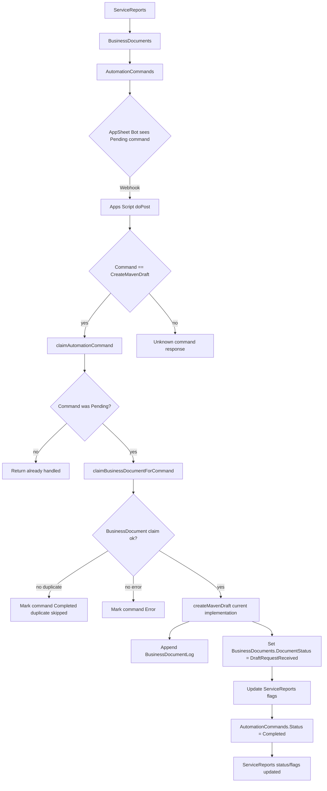
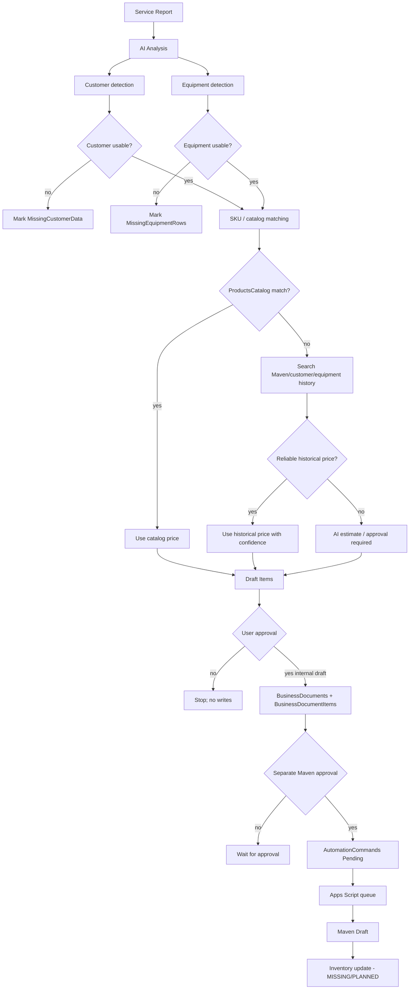
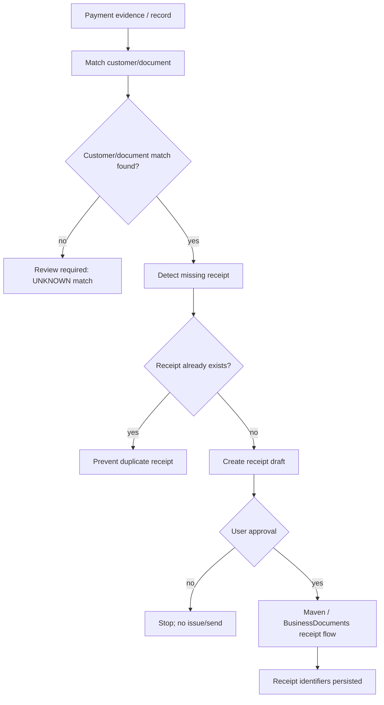
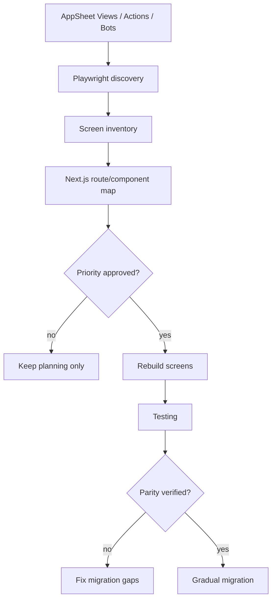
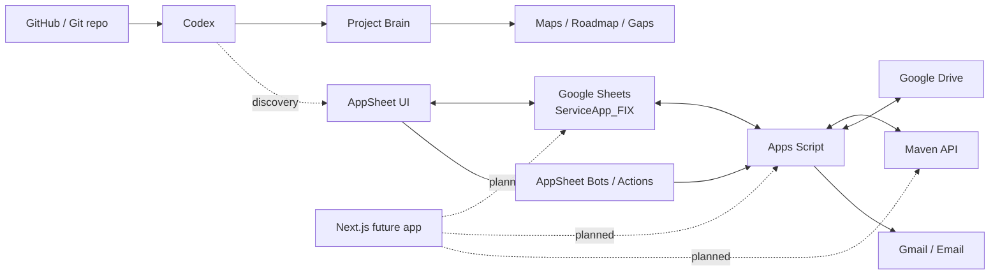

# PROJECT N8N MAP

Last updated: 2026-06-21

These Mermaid maps document current and target flows in an n8n-style format. Missing or unverified pieces are marked `UNKNOWN` or `MISSING`.

## A. Current Working Automation Flow

Trigger: AppSheet/user action creates or updates BusinessDocuments and AutomationCommands.  
Inputs: `ServiceReports`, `BusinessDocuments`, `AutomationCommands`, AppSheet Bot payload.  
Owner systems: AppSheet, Google Sheets, Apps Script, Maven.  
Output: internal draft request status update and AutomationCommands completion. Evidence does not prove real Maven document creation in current code.

Decision points:

- Command must be `CreateMavenDraft`.
- AutomationCommands status must be `Pending`.
- BusinessDocument must not already be claimed by another command.

Missing pieces:

- Confirmed live AppSheet Bot/action definitions.
- Real Maven create-document API call and response persistence.
- Full BusinessDocumentItems consumption.

## B. Target Phase 1 Flow: AI Service Report -> Draft Document

Trigger: User selects a Service Report for AI Draft recommendation.  
Inputs: `ServiceReports`, `ReportEquipmentItems`, `PartsUsed`, `Customers_Final`, `ProductsCatalog`, `InvoiceMavenDocuments`, `InvoiceMavenDocumentItems`.  
Owner systems: AI Draft Agent, Apps Script, AppSheet approval, Maven after approval.  
Output: approved internal draft and future Maven draft.

Missing pieces:

- Approved registry runtime for aliases/equipment/service kits.
- Approved write path to BusinessDocuments and BusinessDocumentItems.
- Maven payload builder and create-document call.
- Inventory update contract.

## C. Phase 2 Receipts Flow

Trigger: Payment evidence or payment record appears.  
Inputs: payment evidence/record, customer, related document, receipt policy.  
Owner systems: UNKNOWN future finance workflow, Maven/BusinessDocuments after approval.  
Output: receipt draft, duplicate prevention.

Missing pieces:

- Payment evidence source is UNKNOWN.
- Receipt table/model is MISSING.
- Maven receipt API contract is UNKNOWN.
- Duplicate receipt key is UNKNOWN.
- Approval UI is UNKNOWN.

## D. AppSheet -> Next.js Migration Flow

Trigger: Migration discovery mission and approved migration phase.  
Inputs: AppSheet views/actions/bots, Google Sheets schemas, Apps Script behavior, Playwright report.  
Owner systems: Codex, AppSheet, Next.js future app.  
Output: route/component/data-source migration map.

Missing pieces:

- Live AppSheet UI scan is blocked by missing URL/session.
- No Next.js app currently exists.
- Data API/backend plan is UNKNOWN.
- Auth and role model are UNKNOWN.

## E. External Systems Map

Trigger: Business workflows and approved automation runs.  
Inputs: operational rows, reports, documents, emails, files, code, approvals.  
Owner systems: mixed.

Missing pieces:

- Next.js app and API integration.
- AppSheet screen/action/bot export.
- External credential handling policy for scanner/runtime.
- Production migration cutover and rollback plan.

