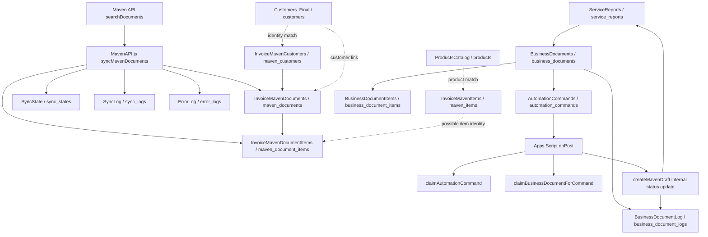

# MAVEN SOURCE INVENTORY

Last updated: 2026-06-25
Scope: Wave 3 read-only Maven source inventory
Status: Documentation-only discovery

## Boundaries

- Read-only inventory only.
- No Maven/Invoice4U execution.
- No Google Sheets, AppSheet, Apps Script, Maven, DB, schema, env, import, customer-facing, inventory, source-system, or production write.
- Evidence comes from local repository docs/source only: `data-sources/tools/SHEETS_REGISTRY.md`, `project-brain/maps/APPSHEET_MAP.md`, `project-brain/maps/SYSTEM_MAP.md`, `project-brain/appsheet-ui/APPSHEET_OBJECT_INVENTORY.md`, `project-brain/appsheet-ui/APPSHEET_ACTION_INVENTORY.md`, `project-brain/appsheet-ui/APPSHEET_BOT_INVENTORY.md`, `project-brain/migration/DATA_MIGRATION_PLAN.md`, `prisma/schema.prisma`, `project-brain/apps-script/MavenAPI.gs`, and `apps-script/MavenAPI.js`.

## Summary

Maven-related state currently spans four categories:

1. Maven imported history/reference data:
   - `InvoiceMavenDocuments`
   - `InvoiceMavenDocumentItems`
   - `InvoiceMavenCustomers`
   - `InvoiceMavenItems`
2. Sync/observability control data:
   - `SyncState`
   - `SyncLog`
   - `ErrorLog`
3. Business workflow bridge data:
   - `BusinessDocuments`
   - `BusinessDocumentItems`
   - `BusinessDocumentLog`
   - `AutomationCommands`
   - selected `ServiceReports` Maven flags
4. Supporting config/governance:
   - `Lists`
   - `AutomationRegistry`
   - `AppMenu`
   - Apps Script properties: `MAVEN_API_KEY`, `BACKFILL_ROW`
   - Apps Script functions in `MavenAPI.js` / `MavenAPI.gs`

The confirmed real Maven API call in local source is document search/import:

- `POST https://app.invoice-maven.co.il/api/documents/searchDocuments`

No checked local source proves the real Maven draft-create endpoint/request/response contract. The current `createMavenDraft(data)` function logs and updates internal Google Sheets/AppSheet workflow state; it does not show a real external draft creation API call.

## Maven Object Inventory

### InvoiceMavenDocuments

Purpose:
Imported Maven document header/history table.

Primary key:
`InvoiceMavenDocumentId`; maps to Prisma `MavenDocument.mavenDocumentExternalId`.

Relationships:
- `InvoiceMavenDocuments.InvoiceMavenCustomerId` or customer fields -> `InvoiceMavenCustomers`.
- `InvoiceMavenDocuments.CustomerID` -> `Customers_Final` when available.
- `InvoiceMavenDocuments.LinkedBusinessDocumentID` / `BusinessDocumentId` -> `BusinessDocuments`.
- Parent of `InvoiceMavenDocumentItems.MavenDocumentId`.

Read/write direction:
- Legacy Apps Script writes/imports rows from Maven search.
- Next.js should read from PostgreSQL after approved import.
- Next.js must not write this table during Wave 3 discovery.

Fields:
`InvoiceMavenDocumentId`, `DocumentNumber`, `DocumentType`, `CustomerID`, `CustomerName`, `DocumentDate`, `TotalAmount`, `VAT`, `Status`, `PaymentStatus`, `PaymentMethod`, `PaidDate`, `PdfLink`, `RawJson`, `LastSyncDate`, `SyncStatus`, `Notes`, `LinkedBusinessDocumentID`, `DocumentYear`, `DocumentMonth`, `DocumentTypeText`, `CustomerNameClean`.

Required fields:
`InvoiceMavenDocumentId`; for useful matching: `DocumentNumber`, `DocumentType`, `CustomerName` or customer ID, `DocumentDate`, `TotalAmount`, `RawJson` when available.

Optional fields:
`VAT`, `PaymentStatus`, `PaymentMethod`, `PaidDate`, `PdfLink`, `LinkedBusinessDocumentID`, `DocumentYear`, `DocumentMonth`, `DocumentTypeText`, `CustomerNameClean`, `Notes`.

Current usage:
- Historical pricing and previous customer document evidence.
- Maven sync history.
- Potential duplicate detection before real Maven execution.

Dependencies:
`MAVEN_API_KEY`, Maven search API, `SyncState`, `SyncLog`, `ErrorLog`, `InvoiceMavenDocumentItems`.

Migration recommendation:
Belongs in Next.js/PostgreSQL as `maven_documents`. Keep read-only at first. Do not disappear; it is key history and duplicate evidence.

### InvoiceMavenDocumentItems

Purpose:
Imported Maven document line-item/history table.

Primary key:
`ItemRowId`; maps to Prisma `MavenDocumentItem.mavenItemRowId`.

Relationships:
- `MavenDocumentId` -> `InvoiceMavenDocuments.InvoiceMavenDocumentId`.
- `CustomerId` / `CustomerName` can support customer matching.
- Item descriptions and prices support AI pricing evidence and future product matching.

Read/write direction:
- Legacy Apps Script writes/imports rows from Maven document `items`.
- Backfill functions can append historical items.
- Next.js should read from PostgreSQL after approved import.

Fields:
`ItemRowId`, `MavenDocumentId`, `DocumentNumber`, `DocumentDate`, `CustomerId`, `CustomerName`, `DocumentType`, `ItemDescription`, `Quantity`, `UnitPrice`, `LineTotal`, `Currency`, `RawItem`, `ImportedAt`.

Required fields:
`ItemRowId`, `MavenDocumentId`; for pricing evidence: `ItemDescription`, `Quantity`, `UnitPrice` or `LineTotal`, `Currency`.

Optional fields:
`DocumentNumber`, `DocumentDate`, `CustomerId`, `CustomerName`, `DocumentType`, `RawItem`, `ImportedAt`.

Current usage:
- Historical item pricing source for AI Draft Preview.
- Maven item sync completeness evidence.
- Line-level duplicate and pricing comparison support.

Dependencies:
`InvoiceMavenDocuments`, Maven `doc.items`, backfill functions, item-row ID generation.

Migration recommendation:
Belongs in Next.js/PostgreSQL as `maven_document_items`. Keep read-only first. Do not disappear; it is required for pricing evidence.

### InvoiceMavenCustomers

Purpose:
Imported Maven customer reference table.

Primary key:
`InvoiceMavenCustomerId`; maps to Prisma `MavenCustomer.mavenCustomerExternalId`.

Relationships:
- May link to `Customers_Final` / Prisma `Customer` by business ID, name, email, phone, or future explicit mapping.
- Parent/reference for `InvoiceMavenDocuments`.

Read/write direction:
- Intended Maven-origin import/reference data.
- No direct sync function was confirmed in local `MavenAPI.js`; source path is partially unknown.
- Next.js should read for matching after approved import.

Fields:
`InvoiceMavenCustomerId`, `CustomerName`, `BusinessID`, `Phone`, `Email`, `Address`, `City`, `RawJson`, `LastSyncDate`, `SyncStatus`, `Notes`.

Required fields:
`InvoiceMavenCustomerId`; for matching: `CustomerName` and/or `BusinessID`.

Optional fields:
`Phone`, `Email`, `Address`, `City`, `RawJson`, `LastSyncDate`, `SyncStatus`, `Notes`.

Current usage:
- Planned/known Maven customer identity evidence.
- Required before real Maven execution to avoid creating/selecting the wrong customer.

Dependencies:
Maven customer export/sync path unknown; `Customers_Final` matching rules.

Migration recommendation:
Belongs in Next.js/PostgreSQL as `maven_customers`. Keep. Requires conservative matching; do not merge aggressively.

### InvoiceMavenItems

Purpose:
Imported Maven item/product catalog reference.

Primary key:
`InvoiceMavenItemId`; maps to Prisma `MavenItem.mavenItemExternalId`.

Relationships:
- `LinkedProductID` -> `ProductsCatalog.ProductID` / Prisma `Product` where reliable.
- `SKU` can overlap with `ProductsCatalog.SKU`.

Read/write direction:
- Intended Maven-origin reference data.
- No direct item-sync function was confirmed in local `MavenAPI.js`; source path is partially unknown.
- Next.js should read for catalog matching after approved import.

Fields:
`InvoiceMavenItemId`, `SKU`, `ExternalItemNumber`, `ItemName`, `ItemDescription`, `UnitPrice`, `PurchasePrice`, `Currency`, `StockQuantity`, `RawJson`, `LastSyncDate`, `SyncStatus`, `Notes`, `LinkedProductID`.

Required fields:
`InvoiceMavenItemId`; for product matching: `SKU` or `ItemName`.

Optional fields:
`ExternalItemNumber`, `ItemDescription`, `UnitPrice`, `PurchasePrice`, `Currency`, `StockQuantity`, `RawJson`, `LastSyncDate`, `SyncStatus`, `Notes`, `LinkedProductID`.

Current usage:
- Future catalog reconciliation and Maven item reference.
- Potential support for real Maven line item IDs if the create-draft API requires item identity.

Dependencies:
Maven item export/sync path unknown; `ProductsCatalog` matching rules.

Migration recommendation:
Belongs in Next.js/PostgreSQL as `maven_items`. Keep read-only initially; reconcile with `ProductsCatalog` before using for execution.

### SyncState

Purpose:
Maven sync checkpoint/state table.

Primary key:
Composite `Source` + `Key`; maps to Prisma unique `[source, key]`.

Relationships:
- `Source=Maven`, `Key=DocumentsLastPage` is used by `syncMavenDocuments()` pagination.
- Controls where Maven document search resumes.

Read/write direction:
- Legacy Apps Script reads and writes.
- Next.js should read/admin-review only until a new sync owner is approved.

Fields:
`Source`, `Key`, `Value`, `UpdatedAt`.

Required fields:
`Source`, `Key`; `Value` required for checkpoint rows.

Optional fields:
`UpdatedAt`.

Current usage:
- Maven pagination checkpoint.
- Critical duplicate/rate-limit control.

Dependencies:
`syncMavenDocuments()`, Maven search API page count, rate limit handling.

Migration recommendation:
Belongs in Next.js/PostgreSQL as `sync_states` if Next.js eventually owns sync. If Apps Script remains sync owner, keep read-only mirror. Must not disappear until all Maven sync is retired.

### SyncLog

Purpose:
Sync execution history.

Primary key:
None confirmed in Sheets; Prisma generates UUID.

Relationships:
- `Source=Maven` rows correspond to `syncMavenDocuments()` runs.

Read/write direction:
- Legacy Apps Script appends rows.
- Next.js should read/admin-review only until sync ownership changes.

Fields:
`[blank/space]`, `Source`, `Added`, `Skipped`, `Status`, `Notes`.

Required fields:
`Source`, `Status`; counts should default to zero if blank.

Optional fields:
Timestamp in first blank/space column, `Added`, `Skipped`, `Notes`.

Current usage:
- Maven sync observability.
- Rate-limit/no-doc/success evidence.

Dependencies:
`syncMavenDocuments()`, sheet header cleanup rules.

Migration recommendation:
Belongs in Next.js/PostgreSQL as `sync_logs` or an observability table. Keep; header anomaly should be normalized during approved import.

### ErrorLog

Purpose:
Error logging for Maven and other Apps Script errors.

Primary key:
None confirmed in Sheets; Prisma generates UUID.

Relationships:
- `Source=Maven`, `FunctionName=syncMavenDocuments` identifies Maven sync errors.

Read/write direction:
- Legacy Apps Script appends rows on errors.
- Next.js should read/admin-review only until observability ownership changes.

Fields:
`DateTime`, `Source`, `FunctionName`, `ErrorMessage`, `RawError`, `Status`.

Required fields:
`DateTime` or created timestamp, `Source`, `ErrorMessage`.

Optional fields:
`FunctionName`, `RawError`, `Status`.

Current usage:
- Maven sync error evidence.
- Runtime troubleshooting.

Dependencies:
Apps Script catch blocks, JSON/raw error preservation.

Migration recommendation:
Belongs in Next.js/PostgreSQL as `error_logs` or general observability. Keep read-only first.

### BusinessDocuments

Purpose:
Internal business document/draft staging header; bridge from AI/user approval to Maven command flow.

Primary key:
`BusinessDocumentId`; maps to Prisma `BusinessDocument.appsheetBusinessDocumentId`.

Relationships:
- `CustomerId` -> `Customers_Final` / Prisma `Customer`.
- `SourceReportId` -> `ServiceReports.ReportID`.
- `MavenDocumentId` / `MavenDocumentNumber` / `MavenPdfLink` -> Maven output evidence.
- Parent of `BusinessDocumentItems`, `BusinessDocumentLog`, and `AutomationCommands`.

Read/write direction:
- Legacy AppSheet/Apps Script write during production flow.
- Next.js currently writes internal staging rows only through protected Server Actions for the shadow runtime.
- No source-system writes during Wave 3.

Fields:
`BusinessDocumentId`, `CustomerId`, `CustomerName`, `SourceReportId`, `SourceReportCounter`, `SourceDocumentId`, `DocumentTypeSuggested`, `DocumentTypeSelected`, `AIReasoning`, `DocumentStatus`, `DraftTitle`, `DocumentDescription`, `ItemsJson`, `SubtotalAmount`, `VATAmount`, `TotalAmount`, `Currency`, `ApprovalStatus`, `ApprovedBy`, `ApprovedAt`, `MavenDocumentId`, `MavenDocumentNumber`, `MavenPdfLink`, `SendByEmail`, `SendByWhatsApp`, `SelectedEmails`, `SelectedPhones`, `SendStatus`, `SendApprovedBy`, `SendApprovedAt`, `LastActionBy`, `LastActionAt`, `CreatedAt`, `UpdatedAt`, `SourceSystem`, `Notes`, `ProcessingCommandId`, `ProcessingStartedAt`.

Required fields:
`BusinessDocumentId`; for Maven readiness: customer, document type, approved status, currency, lines, duplicate-protection state.

Optional fields:
Maven output fields, send fields, selected recipients, notes, processing fields until execution.

Current usage:
- Wave 2 internal draft/review/approval/line resolution.
- Legacy command processing target.
- Real Maven execution source if later approved.

Dependencies:
`BusinessDocumentItems`, `BusinessDocumentLog`, `AutomationCommands`, `ServiceReports`, `Customers_Final`, Maven API contract.

Migration recommendation:
Belongs in Next.js/PostgreSQL as `business_documents`. Keep; it becomes the internal document source of truth. Legacy Sheet version should disappear only after cutover.

### BusinessDocumentItems

Purpose:
Line items for BusinessDocuments and Maven payload lines.

Primary key:
`ItemID`; maps to Prisma `BusinessDocumentItem.appsheetItemId`.

Relationships:
`DocumentID` -> `BusinessDocuments.BusinessDocumentId`; optional product/catalog link.

Read/write direction:
- Legacy AppSheet/AI flow writes.
- Next.js currently writes internal staging rows and line corrections only through protected Server Actions.

Fields:
`ItemID`, `DocumentID`, `ItemName`, `Description`, `Quantity`, `UnitPrice`, `TotalPrice`, `Source`, `ItemType`, `NeedsPriceApproval`.

Required fields:
`DocumentID`, `ItemName`, `Quantity`; for Maven readiness: positive quantity, trusted unit price, total price, approval flag false.

Optional fields:
`ItemID` where generated, `Description`, `Source`, `ItemType`, catalog/product link.

Current usage:
- Maven dry-run payload lines.
- Pricing evidence and approval blocker source.

Dependencies:
`BusinessDocuments`, `ProductsCatalog`, `InvoiceMavenDocumentItems`, line-resolution audit.

Migration recommendation:
Belongs in Next.js/PostgreSQL as `business_document_items`. Keep; it is required for Maven payload review.

### BusinessDocumentLog

Purpose:
Audit log for business document and Maven command workflow.

Primary key:
`LogID`; maps to Prisma `BusinessDocumentLog.appsheetLogId` when present.

Relationships:
`DocumentID` -> `BusinessDocuments.BusinessDocumentId`.

Read/write direction:
- Legacy Apps Script appends rows during command processing.
- Next.js writes internal audit logs for approved protected workflows.

Fields:
`LogID`, `DateTime`, `Action`, `DocumentID`, `PerformedBy`, `Result`, `Notes`, `RawData`.

Required fields:
`Action`, timestamp; `DocumentID` when document-specific.

Optional fields:
`LogID`, `PerformedBy`, `Result`, `Notes`, `RawData`.

Current usage:
- Traceability for AI draft approval, BusinessDocument approval/return, line resolution, Maven webhook/status updates.

Dependencies:
`BusinessDocuments`, Apps Script command flow, Next.js protected Server Actions.

Migration recommendation:
Belongs in Next.js/PostgreSQL as `business_document_logs`. Keep. Legacy shifted-column issue must be resolved before import.

### AutomationCommands

Purpose:
Safe queue table for backend execution and duplicate protection.

Primary key:
`CommandID`; maps to Prisma `AutomationCommand.appsheetCommandId`.

Relationships:
`BusinessDocumentId` -> `BusinessDocuments.BusinessDocumentId`; command payload may include source IDs.

Read/write direction:
- Legacy AppSheet Bot triggers on new row and calls Apps Script webhook.
- Legacy Apps Script claims/updates command status.
- Next.js currently creates one internal staging command through protected Server Action and supports dry-run validation.

Fields:
`CommandID`, `CommandName`, `CommandType`, `Status`, `RequestedBy`, `RequestedAt`, `Result`, `CompletedAt`, `Notes`, `BusinessDocumentId`, `Command`, `ProcessedAt`, `ErrorMessage`.

Required fields:
`CommandID`, command type/command, `Status`, `BusinessDocumentId` for document commands.

Optional fields:
`CommandName`, requester fields, result, timestamps, notes, error message.

Current usage:
- Queueing `CREATE_MAVEN_DRAFT`.
- Dry-run review and payload validation.
- Legacy idempotent claim via `claimAutomationCommand()`.

Dependencies:
AppSheet Bot, Apps Script `doPost`, `claimAutomationCommand`, `BusinessDocuments`, Next.js AutomationCommand pages/actions.

Migration recommendation:
Belongs in Next.js/PostgreSQL as `automation_commands`. Keep. It should not disappear; it is the central queue/idempotency boundary.

### ServiceReports Maven Flags

Purpose:
Service report-level workflow indicators for business draft/Maven/customer send state.

Primary key:
`ServiceReports.ReportID`.

Relationships:
`ServiceReports.ReportID` -> `BusinessDocuments.SourceReportId`.

Read/write direction:
- Legacy Apps Script may update `BusinessDraftCreated`, `MavenDocumentCreated`, `MavenSentToCustomer`.
- Next.js currently reads ServiceReports and must not write these flags without approved workflow ownership.

Fields:
`BusinessDraftCreated`, `DraftDocumentType`, `MavenDocumentCreated`, `MavenSentToCustomer`.

Required fields:
None for read-only display; required only if legacy workflow expects flags.

Optional fields:
All Maven flags are state/visibility indicators.

Current usage:
- Workflow state display/legacy status coordination.

Dependencies:
`updateServiceReportAfterBusinessDraftCreated_()` in root `apps-script/MavenAPI.js`.

Migration recommendation:
Keep in Next.js as derived/display state or replace with relations to `BusinessDocuments`/`MavenDocuments`. Legacy columns should disappear after AppSheet retirement if derived state is sufficient.

### Lists

Purpose:
AppSheet dropdown/reference values.

Primary key:
None; column-based list values.

Relationships:
May define source values for service/report/status fields and possibly document/status mappings.

Read/write direction:
Reference/read-only during discovery.

Fields:
`סוג דוח`, `סוג ציוד`, `סוג שירות`, `מצב מערכת`, `מצב שמן`, `סוג שמן`, `כן/לא`, `סטטוס דוח`, `תת סוג ציוד למדחסי אויר`, `קטגוריית מדחס`.

Required fields:
Unknown for Maven. It is currently not confirmed to include Maven-specific document/status lists.

Optional fields:
All list columns are reference/config values.

Current usage:
General AppSheet dropdowns; not proven Maven-specific.

Dependencies:
AppSheet UI/form configuration.

Migration recommendation:
Do not create a Maven-specific Next.js object unless read-only evidence proves usage. Keep as general reference/config only if needed.

### AutomationRegistry

Purpose:
Automation governance/registry table.

Primary key:
`RegistryId`.

Relationships:
Can reference `AutomationCommandName`, `AppsScriptFile`, `AppsScriptFunction`, `InputTables`, `OutputTables`, Maven effect fields, and audit/log targets.

Read/write direction:
Governance/reference. No runtime use in current Next.js Maven flow.

Fields:
Large registry schema including automation name/type, owner, risk, external system/object/action, trigger, input/output tables, Maven effect fields, idempotency, duplicate detection, approval policy, safe retry, rollback, health checks, audit targets, and notes.

Required fields:
For Maven inventory: automation name, owner, risk, Maven effect, approval, idempotency, input/output tables if populated.

Optional fields:
Most governance/health fields depending on automation row.

Current usage:
Governance and future health mapping; Maven-specific rows unknown/not read live in this task.

Dependencies:
System Health setup/validation scripts.

Migration recommendation:
Not a core Maven business object. Keep as governance/admin reference only if System Health remains in Next.js; otherwise keep outside business runtime.

### AppMenu

Purpose:
App menu/navigation config.

Primary key:
Unknown.

Relationships:
May reference Maven views/routes indirectly.

Read/write direction:
Reference/config only.

Fields:
Not inspected in this Maven inventory.

Required fields:
Unknown.

Optional fields:
Unknown.

Current usage:
App/navigation metadata.

Dependencies:
AppSheet UI/navigation.

Migration recommendation:
Not a Maven data object. Recreate navigation natively in Next.js; source table may disappear after AppSheet retirement.

## Apps Script Maven Functions

### syncMavenDocuments()

Purpose:
Pull Maven document history into Sheets and write line items.

Inputs/dependencies:
`MAVEN_API_KEY`, `InvoiceMavenDocuments`, `InvoiceMavenDocumentItems`, `SyncState`, `SyncLog`, `ErrorLog`, Maven search API.

Read/write direction:
Reads Maven external API; writes Google Sheets `InvoiceMavenDocuments`, `InvoiceMavenDocumentItems`, `SyncState`, `SyncLog`, `ErrorLog`.

Current usage:
Confirmed in both MavenAPI copies, with different date windows between Project Brain snapshot and root source.

Migration recommendation:
Move only after read-only sync ownership design. Until then, keep Apps Script owner and mirror/read in Next.js.

### doPost(e)

Purpose:
Webhook entry point for AutomationCommands.

Inputs/dependencies:
Incoming command payload, `AutomationCommands`, `BusinessDocuments`, `BusinessDocumentLog`.

Read/write direction:
Writes command/document/log state in Sheets.

Current usage:
Routes `Command=CreateMavenDraft` to claim and draft logic.

Migration recommendation:
Replace with Next.js/worker executor only after explicit real execution approval and single-owner cutover. Do not run both owners.

### claimAutomationCommand(commandId)

Purpose:
Idempotently claim a pending command.

Inputs/dependencies:
`AutomationCommands.CommandID`, `AutomationCommands.Status`, `AutomationCommands.Result`.

Read/write direction:
Reads command row; writes `Status=Running`, `Result=Started`.

Current usage:
Duplicate protection in legacy command flow.

Migration recommendation:
Keep concept in Next.js as idempotency enforcement. Legacy function disappears after executor cutover.

### claimBusinessDocumentForCommand(businessDocumentId, commandId)

Purpose:
Claim a BusinessDocument for one command and prevent a second command from processing it.

Inputs/dependencies:
`BusinessDocuments.BusinessDocumentId`, `ProcessingCommandId`, `ProcessingStartedAt`.

Read/write direction:
Reads and writes `BusinessDocuments`.

Current usage:
Present in root `apps-script/MavenAPI.js`; absent from `project-brain/apps-script/MavenAPI.gs` snapshot.

Migration recommendation:
Keep concept in Next.js as document-level idempotency. Snapshot mismatch should be reconciled before production execution work.

### createMavenDraft(data)

Purpose:
Despite the name, checked source shows internal logging and status updates, not a proven Maven external draft-create API request.

Inputs/dependencies:
Command payload, `BusinessDocuments`, `BusinessDocumentLog`, `AutomationCommands`, and in root source also `ServiceReports`.

Read/write direction:
Writes `BusinessDocumentLog`, updates `BusinessDocuments.DocumentStatus=DraftRequestReceived`, updates command status, and may update ServiceReport flags.

Current usage:
Legacy webhook handler for `CreateMavenDraft`.

Migration recommendation:
Do not treat as proven external Maven execution. Before Next.js real execution, obtain actual Maven create-draft API contract and define a new approved executor.

### updateAutomationCommandStatus(commandId, status, result, errorMessage)

Purpose:
Update command outcome fields.

Inputs/dependencies:
`AutomationCommands`.

Read/write direction:
Writes status/result/error/completed timestamp.

Current usage:
Legacy command completion/error handling.

Migration recommendation:
Keep concept in Next.js command lifecycle. Legacy function disappears after executor cutover.

### updateServiceReportAfterBusinessDraftCreated_(ss, sourceReportId, logSheet)

Purpose:
Update ServiceReport workflow flags after a BusinessDocument draft request.

Inputs/dependencies:
`ServiceReports`, `BusinessDocumentLog`.

Read/write direction:
Writes `BusinessDraftCreated=true`, `MavenDocumentCreated=false`, `MavenSentToCustomer=false`.

Current usage:
Present in root `apps-script/MavenAPI.js`; absent from Project Brain snapshot.

Migration recommendation:
Replace with derived status from relations where possible. Avoid writing legacy flags from Next.js until ownership is approved.

### testMavenConnection()

Purpose:
Manual Maven search API test.

Inputs/dependencies:
`MAVEN_API_KEY`, Maven search endpoint.

Read/write direction:
Reads Maven API; logs response.

Current usage:
Manual diagnostic only.

Migration recommendation:
Replace with read-only health check only after explicit API/credential approval.

### runMavenDocumentsSyncNow()

Purpose:
Wrapper that invokes `syncMavenDocuments()`.

Inputs/dependencies:
Same as `syncMavenDocuments()`.

Read/write direction:
Writes via sync function.

Current usage:
Manual trigger.

Migration recommendation:
Do not expose in Next.js without explicit sync ownership and write approval.

### backfillMavenDocumentItems()

Purpose:
Append missing item rows from `InvoiceMavenDocuments.RawJson`.

Inputs/dependencies:
`InvoiceMavenDocuments`, `InvoiceMavenDocumentItems`, `BACKFILL_ROW` script property.

Read/write direction:
Reads document raw JSON; appends item rows; writes script property checkpoint.

Current usage:
Backfill/repair.

Migration recommendation:
Do not migrate as runtime. Convert to an approved one-off migration/repair script only if needed.

### backfillMavenDocumentItemsFrom20230712Preview()

Purpose:
Preview eligible item backfill from a date boundary.

Inputs/dependencies:
`InvoiceMavenDocuments.RawJson`.

Read/write direction:
Read-only preview in source function.

Current usage:
Diagnostic/backfill planning.

Migration recommendation:
Keep as optional read-only validation utility; not a Next.js runtime object.

### backfillMavenDocumentItemsFrom20230712Apply()

Purpose:
Apply item backfill from a date boundary.

Inputs/dependencies:
`InvoiceMavenDocuments`, `InvoiceMavenDocumentItems`.

Read/write direction:
Writes/appends item rows.

Current usage:
Backfill/repair.

Migration recommendation:
Do not migrate as runtime. Convert only to approved one-off migration/repair script if needed.

## Supporting Enums / Lists / Configuration

### Prisma enums

Relevant enums:
- `SourceSystem.MAVEN`
- `BusinessDocumentStatus.DRAFT_REQUEST_RECEIVED`
- `BusinessDocumentStatus.MAVEN_DRAFT_REQUESTED`
- `BusinessDocumentStatus.MAVEN_DRAFT_CREATED`
- `AutomationCommandType.CREATE_MAVEN_DRAFT`
- `AutomationCommandType.SYNC_MAVEN_DOCUMENTS`
- `MatchSource.MAVEN_HISTORY`
- `MavenSyncStatus.IMPORTED`
- `MavenSyncStatus.SKIPPED`
- `MavenSyncStatus.SYNCED`
- `MavenSyncStatus.ERROR`
- `MavenSyncStatus.STALE`
- `MavenSyncStatus.UNKNOWN`
- `PaymentMethod`

Migration recommendation:
Keep in Prisma. Status mapping from source text still requires value inventory before import/execution.

### Apps Script properties

Known keys:
- `MAVEN_API_KEY`
- `BACKFILL_ROW`

Migration recommendation:
Do not move secrets into source. Any Next.js Maven API use requires explicit env/credential approval. Backfill checkpoint should not be a runtime setting after migration.

### Maven search API payload

Observed fields:
`api_key`, `page`, `page_size`, `sort_by`, `sort_dir`, `from_document_date`, `to_document_date`.

Migration recommendation:
Keep only in approved sync service. Current date windows differ between `project-brain/apps-script/MavenAPI.gs` and root `apps-script/MavenAPI.js`; reconcile before sync ownership changes.

## Maven Relationship Diagram

## Maven Data Flow

### Historical sync flow

1. `syncMavenDocuments()` reads `SyncState` for `Maven / DocumentsLastPage`.
2. It calls Maven `searchDocuments`.
3. It skips already imported document IDs.
4. It writes new headers to `InvoiceMavenDocuments`.
5. It writes document line items to `InvoiceMavenDocumentItems`.
6. It writes run outcome to `SyncLog`.
7. It advances `SyncState` only after a successful page.
8. It writes `ErrorLog` on errors.

### Command/draft bridge flow

1. AppSheet or Next.js creates `AutomationCommands` for `CreateMavenDraft` / `CREATE_MAVEN_DRAFT`.
2. AppSheet Bot calls Apps Script `doPost(e)` for legacy command handling.
3. Apps Script claims the command.
4. Root Apps Script also claims the BusinessDocument via `ProcessingCommandId`.
5. `createMavenDraft(data)` logs the webhook, updates `BusinessDocuments.DocumentStatus=DraftRequestReceived`, updates ServiceReport flags when source report exists, and completes/errors the command.
6. Checked source does not prove an external Maven draft-create API call in this function.

### Current Next.js dry-run flow

1. Next.js reads the internal `AutomationCommand`.
2. `lib/maven-draft-payload.ts` validates command/document/customer/items and builds `wouldSendToMaven`.
3. The dry-run Server Action stores dry-run evidence on `AutomationCommand.rawSource.mavenDryRun`.
4. No Maven call occurs.

## Migration Recommendations By Object

| Object | Recommendation |
|---|---|
| `InvoiceMavenDocuments` | Keep in Next.js/PostgreSQL as read-only Maven history; required for duplicate detection, customer history, and payment/document context. |
| `InvoiceMavenDocumentItems` | Keep in Next.js/PostgreSQL as read-only line history; required for pricing evidence. |
| `InvoiceMavenCustomers` | Keep in Next.js/PostgreSQL; required for customer identity matching before execution. |
| `InvoiceMavenItems` | Keep in Next.js/PostgreSQL; reconcile with ProductsCatalog before using for execution. |
| `SyncState` | Keep only while Maven sync exists. If Next.js owns sync later, migrate as admin-only sync state; if Maven sync is retired, archive. |
| `SyncLog` | Keep as observability/audit. Normalize blank timestamp header on import. |
| `ErrorLog` | Keep as observability/audit. |
| `BusinessDocuments` | Keep in Next.js/PostgreSQL as internal document source of truth; legacy Sheet disappears only after cutover. |
| `BusinessDocumentItems` | Keep in Next.js/PostgreSQL as internal line source of truth. |
| `BusinessDocumentLog` | Keep in Next.js/PostgreSQL as audit log; fix shifted-column source mapping before import. |
| `AutomationCommands` | Keep in Next.js/PostgreSQL as queue/idempotency boundary. |
| `ServiceReports` Maven flags | Replace with derived state where possible; keep only compatibility fields until AppSheet retirement. |
| `Lists` | Keep only if values are proven needed; not Maven-specific from current evidence. |
| `AutomationRegistry` | Keep as governance/admin reference if System Health continues; not a Maven business object. |
| `AppMenu` | Recreate natively in Next.js; source table can disappear after AppSheet retirement. |
| Apps Script sync functions | Keep legacy owner until sync ownership is explicitly approved for Next.js. |
| Apps Script command functions | Retire only after one approved executor replaces them; never run two executors for the same command. |
| Backfill functions | Do not migrate as runtime; convert to approved one-off repair/import utilities only if needed. |

## Unknowns / Missing Evidence

1. Real Maven create-draft endpoint, auth method, request fields, response fields, error schema, and rate limits.
2. Whether current production Apps Script matches root `apps-script/MavenAPI.js` or Project Brain snapshot `project-brain/apps-script/MavenAPI.gs`.
3. Whether `InvoiceMavenCustomers` and `InvoiceMavenItems` have active sync functions outside checked source.
4. Current live row counts for Maven-related Sheets were not re-read during this task.
5. Current live AppSheet table/view/action/bot metadata is blocked by previous AppSheet licensing/runtime discovery limits.
6. Exact AppSheet enum/list values for Maven document type/status/payment/status mappings.
7. Customer matching rules between `Customers_Final` and `InvoiceMavenCustomers`.
8. Product/item matching rules between `ProductsCatalog` and `InvoiceMavenItems`.
9. Whether Maven create-draft can accept free-text line items or requires Maven item IDs.
10. VAT/tax behavior for real draft creation.
11. Duplicate detection rules for real external Maven documents beyond internal command idempotency.
12. Whether `createMavenDraft(data)` name is legacy/misleading or whether omitted production source contains an external Maven call.

## Next Safe Tasks

1. Read-only Maven source row-count and schema validation from staging/PostgreSQL and/or approved connector reads.
2. Read-only Maven customer/document/item matching analysis for `NEXT-AI-DRAFT-5806`.
3. Real Maven create-draft API contract evidence packet before any execution implementation.
